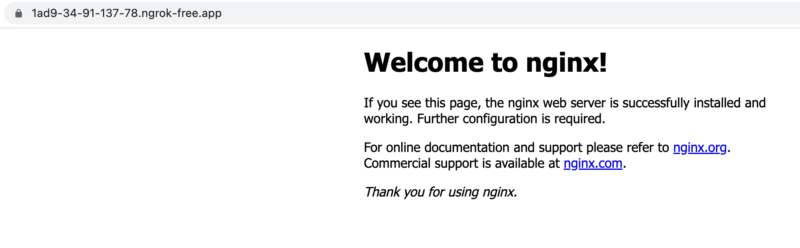

<!-- omit in toc -->
# DevOps Candidate Exam

- The purpose of this exam is to determine is the candidate has the required knowledge for the candidate.

<!-- omit in toc -->
### Table of Contents
- [The exam tasks](#the-exam-tasks)
  - [How to](#how-to)
  - [Part 1 - Docker](#part-1---docker)
    - [1. Write a docker file based upon NodeJs as base image with the following code:](#1-write-a-docker-file-based-upon-nodejs-as-base-image-with-the-following-code)
    - [2. Build the image](#2-build-the-image)
    - [3. Test the docker image](#3-test-the-docker-image)
  - [Part 2 - K8S \& Terraform](#part-2---k8s--terraform)
    - [1. Create K8S cluster](#1-create-k8s-cluster)
    - [2. Terraform](#2-terraform)
    - [3. Terraform and K8S](#3-terraform-and-k8s)
  - [Part 3 - ngrok](#part-3---ngrok)
  - [Bonus questions (Optional, not mandatory and you can answer none, any or all of them)](#bonus-questions-optional-not-mandatory-and-you-can-answer-none-any-or-all-of-them)
    - [Docker](#docker)
    - [Terraform](#terraform)
    - [K8S](#k8s)

### Exam Topics
- Docker
- Terraform
- K8S
- ngrok

### Pre-requirements
- Development environment with the following tools:
  - Docker
  - Terraform
  - K8S cluster

> **If you don't have such an environment you can use a FREE
account at: [https://cloud.google.com](https://cloud.google.com) 
 which has all the above tools pre installed out of the box**

<a href="https://console.cloud.google.com/cloudshell/editor?cloudshell_git_repo=https://github.com/nirgeier/DevOpsExam" rel="nofollow"></a>

---
## The exam tasks

### How to 
- The exam answers can be send via email or uploaded to GitHub and email the url instead of the files.

- **Ask your instructor to which email to send the answers.**

### Part 1 - Docker

  #### 1. Write a docker file based upon NodeJs as base image with the following code:

  - **The expected answer for this question is the Dockerfile**
  - The code for this task should be saved under `src/server.js`

    ```js
    // import the HTTP module
    var http = require('http');

    // Define a port we want to listen to
    const PORT=8080;

    // We need a function which handles requests and send response
    function handleRequest(request, response) {
      response.end('Response from server: !!\nDocker container is up.\n\nURL Path:' + request.url + '\n\n');
    }

    // Create a server
    var server = http.createServer(handleRequest);

    // Start our server
    server.listen(PORT, function(){
        //Callback triggered when server is successfully listening. Hurray!
        console.log("Server listening on: http://localhost:%s", PORT);
    });
    ```

  #### 2. Build the image
    - Once you have a dockerfile, build the docker image
    - The image should be tagged: `server:v1.0`
  
  #### 3. Test the docker image
    - The default port is set to 8080
    - Run the container and verify that the container is working
    - Print out the container logs
  
### Part 2 - K8S & Terraform

  **The expected answer for this question**:
  1. The tf file(s)
  2. A script which will execute the terraform code along with the command which you used to test that the deployment and the service are working as expected.
   
  #### 1. Create K8S cluster
  - Create **any** K8S cluster 
    - If you are working on google console you can use minikube - simply by running the command (**minikube start**)
    - You can also use any other K8S cluster for those task (Rancher, K3S, Kind etc)

  #### 2. Terraform 
  -  Write a Terraform code which will contain the following components:
  
      | Component     | Description                                                                                           |
      | ------------- | ----------------------------------------------------------------------------------------------------- |
      | Variable file | Define input variables as required above, you can also add your own variables if you wish             |
      | Namespace     | Namespace named "exam" (namespace should be set as input variable)                                    |
      | Deployment    | Deploy nginx container (any version) [https://hub.docker.com/_/nginx](https://hub.docker.com/_/nginx) |
      | Service       | port/target port should be defined as terraform `list` variable                                       |

  -  Add ability to change the image version using the variable file
  -  Create a service for the above deployment/pod
  -  Verify that that the container is working

> ### Important note:
>  When working with K8S & terraform locally you need to "configure" `kubectl proxy`   
> and to update your terraform kubernetes provider as well   
> *hint*: [https://registry.terraform.io/providers/hashicorp/kubernetes/latest/docs#credentials-config](https://registry.terraform.io/providers/hashicorp/kubernetes/latest/docs#credentials-config)  
>
> Usage: `kubectl proxy --port=<PORT> --address='0.0.0.0' --accept-hosts='^.*' &`
  
  #### 3. Terraform and K8S 
  - Deploy the resources to K8S cluster
  - Verify that that the namespace exist
  - Verify that your Container is running.
  
### Part 3 - ngrok

 - **Attach the screenshot of ngrok url in your browser ans the answer**
- Sign up to ngrok service [ngrok.com](ngrok.com)
- follow the instructions and install ngrok
 - Download the file
 - Extract the file 
 - Start ngrok on the desired port - as you defined in your terraform variable
 - Use the url from the screen and test the connection to the docker container.
 - Example:
    

---

### Bonus questions (Optional, not mandatory and you can answer none, any or all of them)

#### Docker
1. Write the command which allow you to build docker images for specific platform for example build specific for darwin 
   
#### Terraform
2. Split your terraform files to modules if you haven't done so in your previous answer and update the code to use your modules
3. what is the command to test/debug your tf `local variables`?
  
#### K8S
4. Try to add `MetalLB` to your cluster, in other words use service with a type: `LoadBalancer`

<h1>Good Luck</h1>